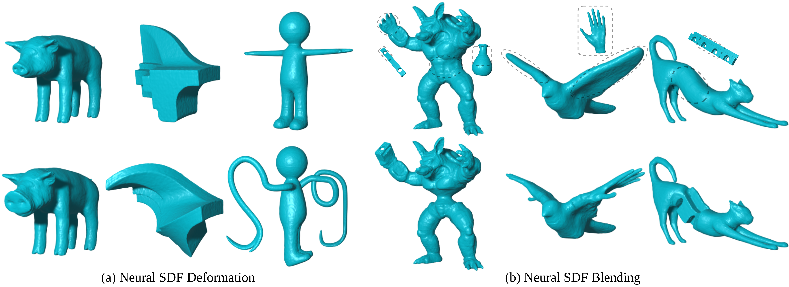

# Neural Generalized Cylinder
PyTorch implementation for paper [Controllable Shape Modeling with Neural Generalized Cylinder](https://arxiv.org/abs/2410.03675).

### [Paper](https://arxiv.org/abs/2410.03675) | [Project](https://uhzoaix.github.io/NeuralGC/)



## Requirements
Install from requirements.txt.
```
pip install -r requirements.txt
```


## Quick Start
For a quick start, we provide the pre-trained model and minimal data for running the demo shape deformation and blending application:

- [demo_data_checkpoint.zip](https://drive.google.com/file/d/1lZ6gV_BTOoUTH9eUy_tm6BC5QwzzOnwH/view?usp=sharing)

Unzip the file at the project root as `results/demo`, which includes the network checkpoint and dataset of NGC handles. Then run the following code:

```
python application.py
```

The outputs can be found in `inference/demo`, and there should be two `.ply` meshes. The first one is a dolphin model blended with the CAD model, and the second one is a pig model with its nose scaled up.

Other examples can be tried by simply specifying the manipulation config in `application.py`. Some manipulation configs can also be found in `exp/demo`.

## Dataset and Training

We provide a processed dataset for training, including 50 meshes with their NGC handles and SDF sampling data.
- [Pack50Dataset.zip](https://drive.google.com/file/d/1xyb0Y34oBc62HjeTGPwESsndWfhjj8sq/view?usp=sharing)

After extracting the dataset from the file, you can specify the training via the config file (`exp/demo/config.yaml` as an example) and run the following code:

```
python train_net.py -c /path/to/your/config.yaml
```

Then triangle meshes can be extracted from the learned Neural SDF via `python inference.py`.

## Data Prepartion

To build your own dataset, it basically requires two crucial steps. Given a watertight mesh, the first step is to generate generalized cylinders (GCs) enclosing the input mesh, where a tight enclosure and low overlapping between GCs is preferable. 

For an automatic generation process, we suggest the users to apply Alpha Wrapping (available in MeshLab and CGAL) or other wrapping algorithms to obtain a strict enclosing shape and then use [Generalized Cylinder Decomposition](https://vcc.tech/research/2015/GCD) (or skeletonization algorithms like meso-skeleton) to obtain the skeletons of GCs. In practice, it probably needs extra manual adjustment of radii and skeleton curve for a better GC enclosure. For further calculation as in `ngc/handle.py`, the GCs are represented as piecewise linear curves and key attributes like radius and local frame (x-axis aligned with the curve tangent vector). A fully automatic algorithm and wiser representation are left to the future work.

The second step is to generate samples and ground truth SDF values for network training. Here we refer the users to `ngc/process_data.py` for details.